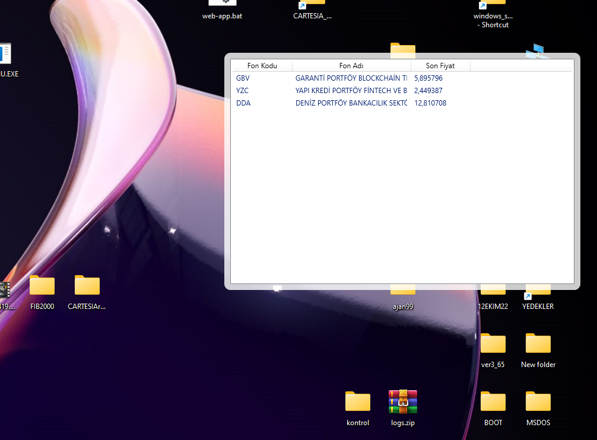
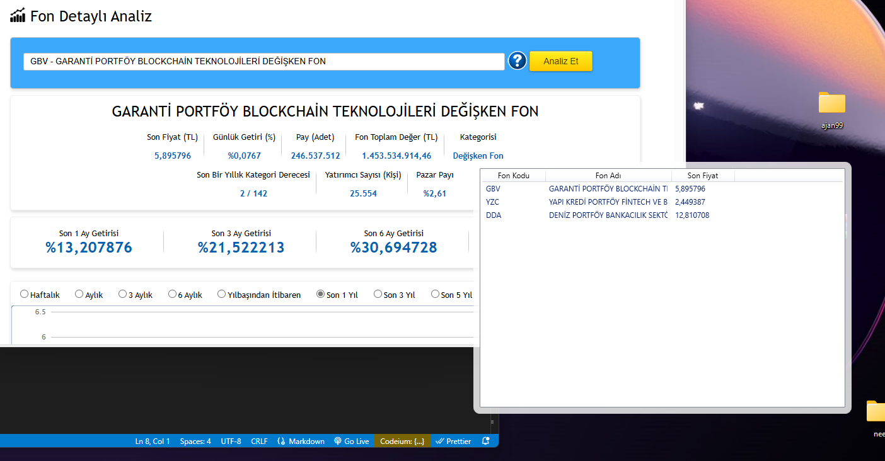

# Fon-Widgets Project

Bu proje, masaüstü widget'ı ve Node.js sunucusunu içeren bir fon takip uygulamasıdır.
Amaç TEFAS taki fonları her gün ilgili sayfalara girmeden masaüstünde direk görmek. 

## Ekran Görüntüleri 
 
 


## Klasör Yapısı

- `nodejs-server/`: Node.js sunucusu için kaynak dosyalar. (Cors polisiyi aşmak için node.js kullanıldı.)
- `wpf-app/`: WPF uygulaması için kaynak dosyalar.

## Kurulum

### Node.js Sunucusu

1. `nodejs-server/` klasörüne gidin.
2. Gerekli paketleri yüklemek için aşağıdaki komutu çalıştırın:
   ```bash
   npm install
2. Sunucuyu başlatmak için
   ```bash
   node server.js

